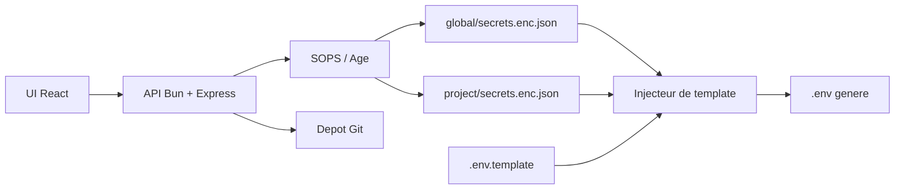

<p align="center">
  
</p>

<div align="center">

# Rage UI

Manager de secrets local-first et injecteur GitOps de fichiers `.env` pour homelab et projets personnels.

[](https://github.com/Sofian-bll/Rage-UI/blob/main/LICENSE)
[](https://github.com/Sofian-bll/Rage-UI/tags)
[](https://github.com/Sofian-bll/Rage-UI/stargazers)
[](frontend/package.json)
[](backend/package.json)
[](docker-compose.yml)

</div>

> [Read in English](README.md) | [Lire en Français](README.fr.md)

## C'est quoi ?

Rage UI est une application web local-first pour gérer des secrets partagés et des secrets par projet. Elle stocke les secrets dans des fichiers JSON chiffrés avec SOPS/Age, permet de les éditer depuis une UI React, puis les injecte dans des fichiers `.env` à partir de templates.

Le projet vise les infrastructures personnelles, les homelabs et les petits ensembles de projets où les mêmes tokens ou clés API sont réutilisés, tout en restant chiffrés dans Git.

## Fonctionnement

1. Garde les valeurs partagées dans un projet central `global/`.
2. Garde les valeurs spécifiques à chaque projet dans son dossier.
3. Décris les fichiers `.env.template` avec des placeholders comme `{{GLOBAL.DO_TOKEN}}` ou `{{PORT}}`.
4. Clique sur **Inject .env** pour fusionner les secrets globaux et locaux dans un fichier `.env` généré.
5. Synchronise les fichiers de secrets chiffrés avec Git, pas les fichiers `.env` générés.

```text
PROJECTS_DIR/
├── global/
│   └── secrets.enc.json
├── pokedex/
│   ├── .env.template
│   └── secrets.enc.json
└── api_meteo/
    ├── .env.template
    └── secrets.enc.json
```

## Architecture



## Démarrage Rapide

### Prérequis

- Bun pour le backend.
- Node.js et npm pour le frontend Vite.
- SOPS et une clé Age pour chiffrer de vrais secrets.

### 1. Cloner le dépôt

```bash
git clone https://github.com/Sofian-bll/Rage-UI.git
cd Rage-UI
```

### 2. Lancer le backend

```bash
cd backend
bun install
bun run server.ts
```

L'API tourne sur `http://localhost:3000`.

### 3. Lancer le frontend

Ouvre un deuxième terminal depuis la racine du dépôt :

```bash
cd frontend
npm install
npm run dev
```

Le frontend tourne sur `http://localhost:5173` et proxy les appels `/api` vers le backend.

### 4. Tester l'injection

1. Sélectionne `global` et ajoute un secret partagé comme `POKE_API_KEY`.
2. Sélectionne un projet comme `pokedex` et ajoute une valeur locale comme `PORT`.
3. Clique sur **Inject .env**.
4. Vérifie le fichier `.env` généré dans le dossier du projet.

## Syntaxe des Templates

| Syntaxe | Source | Exemple |
|---------|--------|---------|
| `{{GLOBAL.KEY}}` | Secret du dossier `global/` | `{{GLOBAL.DO_TOKEN}}` |
| `{{KEY}}` | Secret du projet actif | `{{PORT}}` |

Les secrets locaux remplacent les secrets globaux quand la même clé existe aux deux endroits.

Exemple de `.env.template` :

```dotenv
POKE_API_KEY={{GLOBAL.POKE_API_KEY}}
DO_TOKEN={{GLOBAL.DO_TOKEN}}
PORT={{PORT}}
HOST=pokedex.local
```

## Configuration

| Variable | Rôle | Défaut |
|----------|------|--------|
| `PROJECTS_DIR` | Dossier contenant `global/` et les projets | `./projects` |
| `APP_API_KEY` | Clé API optionnelle pour les routes d'écriture via `x-api-key` | non défini |
| `SOPS_AGE_KEY_FILE` | Clé privée Age utilisée par SOPS | chemin SOPS par défaut |

Pour créer une clé Age :

```bash
brew install sops age
age-keygen -o ~/.config/sops/age/keys.txt
```

Ajoute la clé publique affichée dans le fichier `.sops.yaml` du dépôt de secrets.

## Docker

Le dépôt contient une configuration Docker multi-stage qui sert le frontend compilé et le backend depuis un seul conteneur.

```bash
docker-compose up -d --build
```

Le fichier compose monte trois ressources de l'hôte :

- la clé Age de SOPS
- la clé SSH utilisée pour la synchronisation Git
- le dossier des projets monté comme `PROJECTS_DIR`

## Résumé de l'API

| Méthode | Route | Description | Auth |
|---------|-------|-------------|------|
| `GET` | `/api/projects` | Liste les dossiers de projets dans `PROJECTS_DIR` | public |
| `GET` | `/api/secrets/:project` | Déchiffre et retourne les secrets d'un projet | public |
| `POST` | `/api/secrets/:project` | Chiffre et sauvegarde les secrets d'un projet | `APP_API_KEY` si défini |
| `POST` | `/api/inject/:project` | Fusionne les secrets dans `.env.template` et écrit `.env` | `APP_API_KEY` si défini |
| `GET` | `/api/git/status` | Retourne l'état Git du dossier de projets | public |
| `POST` | `/api/git/sync` | Lance add, commit et push pour les secrets chiffrés | `APP_API_KEY` si défini |

## Structure du Projet

```text
Rage-UI/
├── assets/
│   └── logo.svg
├── backend/
│   ├── app.ts
│   ├── app.test.ts
│   ├── package.json
│   └── server.ts
├── docs/
│   ├── index.html
│   └── logo.svg
├── e2e/
│   ├── package.json
│   └── playwright.config.ts
├── frontend/
│   ├── package.json
│   ├── src/
│   └── vite.config.js
├── DAT-SOPS-GitOps-Architecture.pdf
├── Dockerfile
├── docker-compose.yml
├── LICENSE
└── README.md
```

## Documentation

| Ressource | Description |
|-----------|-------------|
| [`README.md`](README.md) | Version anglaise de ce README. |
| [`backend/README.md`](backend/README.md) | Notes backend. |
| [`frontend/README.md`](frontend/README.md) | Notes frontend. |
| [`docs/index.html`](docs/index.html) | Page portfolio pour GitHub Pages. |
| [`DAT-SOPS-GitOps-Architecture.pdf`](DAT-SOPS-GitOps-Architecture.pdf) | Document d'architecture. |

## Tests

```bash
# Backend
cd backend && bun test

# Frontend
cd frontend && npm run test

# End-to-end, avec backend et frontend déjà lancés
cd e2e && npm run test
```

## Notes de Sécurité

- Commit les fichiers `secrets.enc.json` chiffrés, pas les fichiers `.env` générés.
- Ne commit jamais les clés privées Age, les clés SSH ou les fichiers `.env` locaux.
- Utilise `APP_API_KEY` si l'application est exposée au-delà d'un environnement local de confiance.
- Considère Rage UI comme un panneau de contrôle local/homelab, pas comme un gestionnaire de secrets public multi-tenant.

## Contribuer

Les issues et petites améliorations sont bienvenues. Garde les changements ciblés, ajoute ou mets à jour les tests quand le comportement change, et évite de committer de vrais secrets ou des fichiers `.env` générés.

<a href="https://github.com/Sofian-bll/Rage-UI/graphs/contributors">
  
</a>

## Licence

Rage UI est publié sous licence [MIT](LICENSE).

---

<div align="center">

[](https://star-history.com/#Sofian-bll/Rage-UI&Date)

</div>
