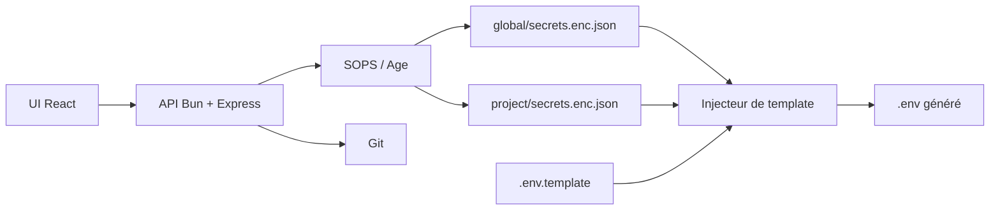

<p align="center">
  
</p>

<div align="center">

# Rage UI

Dashboard de secrets local-first et injecteur GitOps de fichiers `.env`.

[](https://github.com/Sofian-bll/Rage-UI/blob/main/LICENSE)
[](https://github.com/Sofian-bll/Rage-UI/tags)
[](https://github.com/Sofian-bll/Rage-UI/stargazers)

</div>

> [Read in English](README.md) | [Lire en Français](README.fr.md)

## C'est quoi ?

Rage UI est un dashboard web local-first pour gérer des secrets partagés et des secrets par projet. Il stocke les secrets dans des fichiers JSON chiffrés avec SOPS/Age, permet de les éditer depuis une interface React, et les injecte dans des fichiers `.env` à partir de templates.

Conçu pour l'infrastructure personnelle, les homelabs et les petits parcs de projets où les mêmes tokens ou clés API sont réutilisés tout en restant chiffrés dans Git.



## Démarrage rapide

```bash
git clone https://github.com/Sofian-bll/Rage-UI.git
cd Rage-UI

# Backend (Bun)
cd backend && bun install && bun run server.ts

# Frontend (Vite + React) — deuxième terminal
cd frontend && npm install && npm run dev
```

Backend : `http://localhost:3000` · Frontend : `http://localhost:5173`

## Fonctionnement

1. Garde les secrets partagés dans `global/`
2. Définis `.env.template` avec les placeholders `{{GLOBAL.KEY}}` et `{{KEY}}`
3. Clique sur **Inject .env** pour fusionner global + local dans un `.env` généré
4. Synchronise les fichiers chiffrés avec Git depuis l'interface

```
PROJECTS_DIR/
├── global/secrets.enc.json
├── pokedex/.env.template + secrets.enc.json
└── api_meteo/.env.template
```

## Configuration

| Variable | Rôle | Défaut |
|----------|------|--------|
| `PROJECTS_DIR` | Dossier des projets | `./projects` |
| `APP_API_KEY` | Clé API optionnelle pour les routes d'écriture | non défini |
| `SOPS_AGE_KEY_FILE` | Chemin de la clé Age | défaut SOPS |

## Docker

```bash
docker-compose up -d --build
```

Montages : clé Age SOPS, clé SSH, dossier des projets.

## API

| Méthode | Route | Auth |
|---------|-------|------|
| `GET` | `/api/projects` | public |
| `GET` | `/api/secrets/:project` | public |
| `POST` | `/api/secrets/:project` | clé API |
| `POST` | `/api/inject/:project` | clé API |
| `GET` | `/api/git/status` | public |
| `POST` | `/api/git/sync` | clé API |

## Structure du projet

```
Rage-UI/
├── assets/
│   └── logo.png
├── backend/
│   ├── app.ts
│   ├── app.test.ts
│   └── server.ts
├── docs/
│   ├── index.html
│   └── logo.png
├── e2e/
│   └── playwright.config.ts
├── frontend/
│   ├── src/
│   └── vite.config.js
├── Dockerfile
├── docker-compose.yml
├── LICENSE
├── README.md
└── README.fr.md
```

## Documentation

| Ressource | Description |
|-----------|-------------|
| [`README.md`](README.md) | Version anglaise |
| [`docs/index.html`](docs/index.html) | Page portfolio |
| [`backend/README.md`](backend/README.md) | Notes backend |
| [`frontend/README.md`](frontend/README.md) | Notes frontend |

## Tests

```bash
cd backend && bun test          # Backend
cd frontend && npm run test      # Frontend
cd e2e && npm run test           # E2E (backend + frontend lancés)
```

## Licence

Rage UI est publié sous licence [MIT](LICENSE).

## Contribuer

Les issues et améliorations sont bienvenues. Garde les changements ciblés, mets à jour les tests et ne commit jamais de vrais secrets ni de fichiers `.env`.

<a href="https://github.com/Sofian-bll/Rage-UI/graphs/contributors">
  
</a>

---

<div align="center">

[](https://star-history.com/#Sofian-bll/Rage-UI&Date)

</div>
