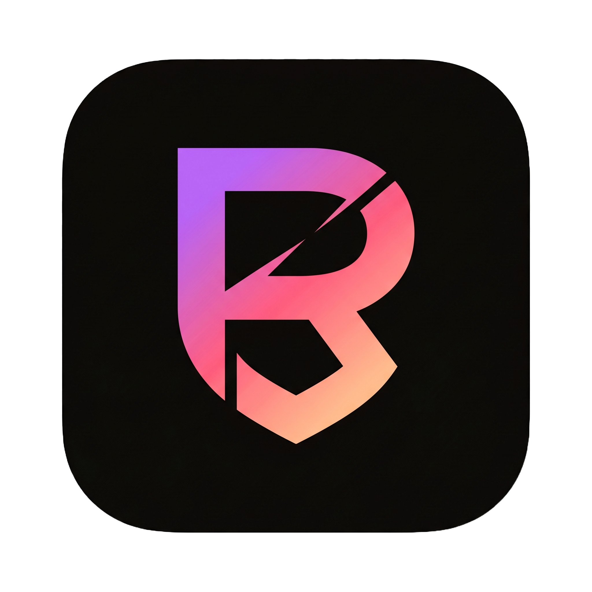
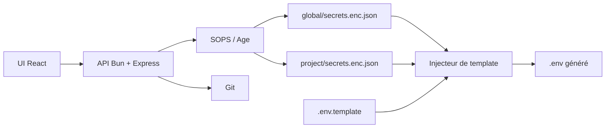

<div align="center">

[](https://github.com/Sofian-bll/Rage-UI/blob/main/LICENSE)
[](https://github.com/Sofian-bll/Rage-UI/releases)
[](https://github.com/Sofian-bll/Rage-UI/stargazers)

<p align="center">
  <a href="https://sofian-bll.github.io/Rage-UI/"><strong>Voir la démo</strong></a>
  ·
  <a href="https://github.com/Sofian-bll/Rage-UI/issues/new?labels=bug"><strong>Signaler un bug</strong></a>
  ·
  <a href="https://github.com/Sofian-bll/Rage-UI/issues/new?labels=enhancement"><strong>Proposer une fonctionnalité</strong></a>
</p>

<p align="center">
  
</p>

<h1 id="readme-top" align="center">Rage UI</h1>

<p align="center">Dashboard de secrets local-first et injecteur GitOps de fichiers `.env`.</p>

<p align="center">🇬🇧 <a href="README.md">English</a> · 🇫🇷 <a href="README.fr.md"><b>Français</b></a></p>

</div>

## Table des matières

<details open>
  <summary>Table des matières</summary>
  <ol>
    <li><a href="#cest-quoi">C'est quoi ?</a></li>
    <li><a href="#construit-avec">Construit avec</a></li>
    <li><a href="#démarrage-rapide">Démarrage rapide</a></li>
    <li><a href="#fonctionnement">Fonctionnement</a></li>
    <li><a href="#configuration">Configuration</a></li>
    <li><a href="#docker">Docker</a></li>
    <li><a href="#api">API</a></li>
    <li><a href="#structure-du-projet">Structure du projet</a></li>
    <li><a href="#documentation">Documentation</a></li>
    <li><a href="#tests">Tests</a></li>
    <li><a href="#licence">Licence</a></li>
    <li><a href="#contribuer">Contribuer</a></li>
  </ol>
</details>

## C'est quoi ?

Rage UI est un dashboard web local-first pour gérer des secrets partagés et des secrets par projet. Il stocke les secrets dans des fichiers JSON chiffrés avec SOPS/Age, permet de les éditer depuis une interface React, et les injecte dans des fichiers `.env` à partir de templates.

Conçu pour l'infrastructure personnelle, les homelabs et les petits parcs de projets où les mêmes tokens ou clés API sont réutilisés tout en restant chiffrés dans Git.



<p align="right">(<a href="#readme-top">retour en haut</a>)</p>

## Construit avec

- [![Bun][Bun]][Bun-url] — Runtime JavaScript & backend
- [![React][React]][React-url] — Framework UI
- [![Express][Express]][Express-url] — Serveur HTTP
- [![Vite][Vite]][Vite-url] — Bundler frontend
- [![TypeScript][TypeScript]][TypeScript-url] — Typage backend
- [![SOPS][SOPS]][SOPS-url] — Chiffrement des secrets
- [![Docker][Docker]][Docker-url] — Déploiement conteneurisé
- [![Playwright][Playwright]][Playwright-url] — Tests E2E
- [![Vitest][Vitest]][Vitest-url] — Tests unitaires

<p align="right">(<a href="#readme-top">retour en haut</a>)</p>

## Démarrage rapide

```bash
git clone https://github.com/Sofian-bll/Rage-UI.git
cd Rage-UI

# Backend (Bun)
cd backend && bun install && bun run server.ts

# Frontend (Vite + React) — deuxième terminal
cd frontend && npm install && npm run dev
```

Backend : `http://localhost:3000` · Frontend : `http://localhost:5173`

<p align="right">(<a href="#readme-top">retour en haut</a>)</p>

## Fonctionnement

1. Garde les secrets partagés dans `global/`
2. Définis `.env.template` avec les placeholders `{{GLOBAL.KEY}}` et `{{KEY}}`
3. Clique sur **Inject .env** pour fusionner global + local dans un `.env` généré
4. Synchronise les fichiers chiffrés avec Git depuis l'interface

```
PROJECTS_DIR/
├── global/secrets.enc.json
├── pokedex/.env.template + secrets.enc.json
└── api_meteo/.env.template
```

<p align="right">(<a href="#readme-top">retour en haut</a>)</p>

## Configuration

| Variable | Rôle | Défaut |
|----------|------|--------|
| `PROJECTS_DIR` | Dossier des projets | `./projects` |
| `APP_API_KEY` | Clé API optionnelle pour les routes d'écriture | non défini |
| `SOPS_AGE_KEY_FILE` | Chemin de la clé Age | défaut SOPS |

<p align="right">(<a href="#readme-top">retour en haut</a>)</p>

## Docker

```bash
docker-compose up -d --build
```

Montages : clé Age SOPS, clé SSH, dossier des projets.

<p align="right">(<a href="#readme-top">retour en haut</a>)</p>

## API

| Méthode | Route | Auth |
|---------|-------|------|
| `GET` | `/api/projects` | public |
| `GET` | `/api/secrets/:project` | public |
| `POST` | `/api/secrets/:project` | clé API |
| `POST` | `/api/inject/:project` | clé API |
| `GET` | `/api/git/status` | public |
| `POST` | `/api/git/sync` | clé API |

<p align="right">(<a href="#readme-top">retour en haut</a>)</p>

## Structure du projet

```
Rage-UI/
├── docs/
│   ├── assets/                (logo + screenshot)
│   ├── superpowers/           (plans & specs)
│   └── index.html             (page d'accueil)
├── backend/
│   ├── app.ts                 (routes API)
│   ├── app.test.ts
│   ├── server.ts              (point d'entrée)
│   ├── projects/              (données d'exemple : api_meteo, pokedex)
│   └── secrets.json           (secrets de dev)
├── e2e/
│   ├── tests/                 (app.spec.ts, screenshot.spec.ts)
│   └── playwright.config.ts
├── frontend/
│   ├── src/                   (App, editor, gitpanel, shell, settings)
│   └── vite.config.js
├── Dockerfile
├── docker-compose.yml
├── LICENSE
├── README.md
└── README.fr.md
```

<p align="right">(<a href="#readme-top">retour en haut</a>)</p>

## Documentation

| Ressource | Description |
|-----------|-------------|
| [`README.md`](README.md) | Version anglaise |
| [`docs/index.html`](docs/index.html) | Page portfolio |
| [`backend/README.md`](backend/README.md) | Notes backend |
| [`frontend/README.md`](frontend/README.md) | Notes frontend |

<p align="right">(<a href="#readme-top">retour en haut</a>)</p>

## Tests

```bash
cd backend && bun test          # Backend
cd frontend && npm run test      # Frontend
cd e2e && npm run test           # E2E (backend + frontend lancés)
```

<p align="right">(<a href="#readme-top">retour en haut</a>)</p>

## Licence

Rage UI est publié sous licence [MIT](LICENSE).

<p align="right">(<a href="#readme-top">retour en haut</a>)</p>

## Contribuer

Les issues et améliorations sont bienvenues. Garde les changements ciblés, mets à jour les tests et ne commit jamais de vrais secrets ni de fichiers `.env`.

<a href="https://github.com/Sofian-bll/Rage-UI/graphs/contributors">
  
</a>

<p align="right">(<a href="#readme-top">retour en haut</a>)</p>

---

<div align="center">

[](https://star-history.com/#Sofian-bll/Rage-UI&Date)

</div>

<!-- REFERENCE_LINKS -->
[Bun]: https://img.shields.io/badge/Bun-%23000000.svg?style=flat&logo=bun&logoColor=white
[Bun-url]: https://bun.sh
[React]: https://img.shields.io/badge/react-%2320232a.svg?style=flat&logo=react&logoColor=%2361DAFB
[React-url]: https://react.dev
[Express]: https://img.shields.io/badge/express.js-%23404d59.svg?style=flat&logo=express&logoColor=%2361DAFB
[Express-url]: https://expressjs.com
[Vite]: https://img.shields.io/badge/vite-%23646CFF.svg?style=flat&logo=vite&logoColor=white
[Vite-url]: https://vitejs.dev
[TypeScript]: https://img.shields.io/badge/typescript-%23007ACC.svg?style=flat&logo=typescript&logoColor=white
[TypeScript-url]: https://www.typescriptlang.org
[SOPS]: https://img.shields.io/badge/SOPS-%23000000.svg?style=flat&logo=mozilla&logoColor=white
[SOPS-url]: https://github.com/getsops/sops
[Docker]: https://img.shields.io/badge/docker-%230db7ed.svg?style=flat&logo=docker&logoColor=white
[Docker-url]: https://www.docker.com
[Playwright]: https://img.shields.io/badge/Playwright-%2345ba4b.svg?style=flat&logo=playwright&logoColor=white
[Playwright-url]: https://playwright.dev
[Vitest]: https://img.shields.io/badge/Vitest-%236E9F00.svg?style=flat&logo=vitest&logoColor=white
[Vitest-url]: https://vitest.dev
