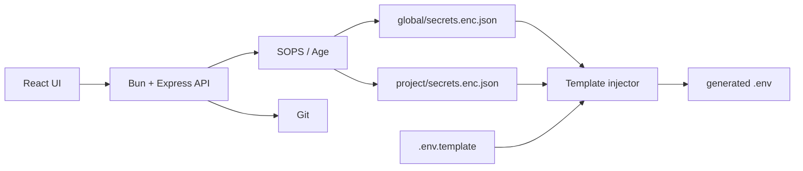

<div align="center">

[](https://github.com/Sofian-bll/Rage-UI/blob/main/LICENSE)
[](https://github.com/Sofian-bll/Rage-UI/releases)
[](https://github.com/Sofian-bll/Rage-UI/stargazers)

<p align="center">
  <a href="https://sofian-bll.github.io/Rage-UI/"><strong>View Demo</strong></a>
  ·
  <a href="https://github.com/Sofian-bll/Rage-UI/issues/new?labels=bug"><strong>Report Bug</strong></a>
  ·
  <a href="https://github.com/Sofian-bll/Rage-UI/issues/new?labels=enhancement"><strong>Request Feature</strong></a>
</p>

<p align="center">
  
</p>

<h1 id="readme-top" align="center">Rage UI</h1>

<p align="center">Local-first secrets dashboard and GitOps `.env` injector.</p>

<p align="center">🇬🇧 <a href="README.md"><b>English</b></a> · 🇫🇷 <a href="README.fr.md">Français</a></p>

</div>

## Table of Contents

<details open>
  <summary>Table of Contents</summary>
  <ol>
    <li><a href="#what-is-this">What is this?</a></li>
    <li><a href="#built-with">Built With</a></li>
    <li><a href="#quick-start">Quick Start</a></li>
    <li><a href="#how-it-works">How it works</a></li>
    <li><a href="#configuration">Configuration</a></li>
    <li><a href="#docker">Docker</a></li>
    <li><a href="#api">API</a></li>
    <li><a href="#project-structure">Project Structure</a></li>
    <li><a href="#documentation">Documentation</a></li>
    <li><a href="#tests">Tests</a></li>
    <li><a href="#license">License</a></li>
    <li><a href="#contributing">Contributing</a></li>
  </ol>
</details>

## What is this?

Rage UI is a local-first web dashboard for managing shared and per-project secrets. It stores secrets as SOPS/Age-encrypted JSON files, lets you edit them from a React UI, and injects them into project `.env` files from templates.

Built for personal infrastructure, homelabs, and small project fleets where the same tokens or API keys are reused across several apps but should stay encrypted in Git.



<p align="right">(<a href="#readme-top">back to top</a>)</p>

## Built With

- [![Bun][Bun]][Bun-url] — JavaScript runtime & backend
- [![React][React]][React-url] — UI framework
- [![Express][Express]][Express-url] — HTTP server
- [![Vite][Vite]][Vite-url] — Frontend build tool
- [![TypeScript][TypeScript]][TypeScript-url] — Backend type safety
- [![SOPS][SOPS]][SOPS-url] — Secrets encryption
- [![Docker][Docker]][Docker-url] — Container deployment
- [![Playwright][Playwright]][Playwright-url] — E2E testing
- [![Vitest][Vitest]][Vitest-url] — Unit testing

<p align="right">(<a href="#readme-top">back to top</a>)</p>

## Quick Start

```bash
git clone https://github.com/Sofian-bll/Rage-UI.git
cd Rage-UI

# Backend (Bun)
cd backend && bun install && bun run server.ts

# Frontend (Vite + React) — second terminal
cd frontend && npm install && npm run dev
```

Backend: `http://localhost:3000` · Frontend: `http://localhost:5173`

<p align="right">(<a href="#readme-top">back to top</a>)</p>

## How it works

1. Keep shared secrets in `global/`
2. Define `.env.template` with `{{GLOBAL.KEY}}` and `{{KEY}}` placeholders
3. Click **Inject .env** to merge global + local into a generated `.env`
4. Sync encrypted files through Git from the UI

```
PROJECTS_DIR/
├── global/secrets.enc.json
├── pokedex/.env.template + secrets.enc.json
└── api_meteo/.env.template
```

<p align="right">(<a href="#readme-top">back to top</a>)</p>

## Configuration

| Variable | Purpose | Default |
|----------|---------|---------|
| `PROJECTS_DIR` | Projects directory | `./projects` |
| `APP_API_KEY` | Optional API key for write routes | unset |
| `SOPS_AGE_KEY_FILE` | Age key path | SOPS default |

<p align="right">(<a href="#readme-top">back to top</a>)</p>

## Docker

```bash
docker-compose up -d --build
```

Mounts: SOPS Age key, SSH key, projects directory.

<p align="right">(<a href="#readme-top">back to top</a>)</p>

## API

| Method | Route | Auth |
|--------|-------|------|
| `GET` | `/api/projects` | public |
| `GET` | `/api/secrets/:project` | public |
| `POST` | `/api/secrets/:project` | API key |
| `POST` | `/api/inject/:project` | API key |
| `GET` | `/api/git/status` | public |
| `POST` | `/api/git/sync` | API key |

<p align="right">(<a href="#readme-top">back to top</a>)</p>

## Project Structure

```
Rage-UI/
├── docs/
│   ├── assets/                (logo + screenshot)
│   ├── superpowers/           (plans & specs)
│   └── index.html             (landing page)
├── backend/
│   ├── app.ts                 (API routes)
│   ├── app.test.ts
│   ├── server.ts              (entry point)
│   ├── projects/              (sample data: api_meteo, pokedex)
│   └── secrets.json           (dev secrets)
├── e2e/
│   ├── tests/                 (app.spec.ts, screenshot.spec.ts)
│   └── playwright.config.ts
├── frontend/
│   ├── src/                   (App, editor, gitpanel, shell, settings)
│   └── vite.config.js
├── Dockerfile
├── docker-compose.yml
├── LICENSE
├── README.md
└── README.fr.md
```

<p align="right">(<a href="#readme-top">back to top</a>)</p>

## Documentation

| Resource | Description |
|----------|-------------|
| [`README.fr.md`](README.fr.md) | French version |
| [`docs/index.html`](docs/index.html) | Landing page |
| [`backend/README.md`](backend/README.md) | Backend notes |
| [`frontend/README.md`](frontend/README.md) | Frontend notes |

<p align="right">(<a href="#readme-top">back to top</a>)</p>

## Tests

```bash
cd backend && bun test          # Backend
cd frontend && npm run test      # Frontend
cd e2e && npm run test           # E2E (needs backend + frontend running)
```

<p align="right">(<a href="#readme-top">back to top</a>)</p>

## License

Rage UI is released under the [MIT License](LICENSE).

<p align="right">(<a href="#readme-top">back to top</a>)</p>

## Contributing

Issues and improvements welcome. Keep changes focused, update tests, and never commit real secrets or `.env` files.

<a href="https://github.com/Sofian-bll/Rage-UI/graphs/contributors">
  
</a>

<p align="right">(<a href="#readme-top">back to top</a>)</p>

---

<div align="center">

[](https://star-history.com/#Sofian-bll/Rage-UI&Date)

</div>

<!-- REFERENCE_LINKS -->
[Bun]: https://img.shields.io/badge/Bun-%23000000.svg?style=flat&logo=bun&logoColor=white
[Bun-url]: https://bun.sh
[React]: https://img.shields.io/badge/react-%2320232a.svg?style=flat&logo=react&logoColor=%2361DAFB
[React-url]: https://react.dev
[Express]: https://img.shields.io/badge/express.js-%23404d59.svg?style=flat&logo=express&logoColor=%2361DAFB
[Express-url]: https://expressjs.com
[Vite]: https://img.shields.io/badge/vite-%23646CFF.svg?style=flat&logo=vite&logoColor=white
[Vite-url]: https://vitejs.dev
[TypeScript]: https://img.shields.io/badge/typescript-%23007ACC.svg?style=flat&logo=typescript&logoColor=white
[TypeScript-url]: https://www.typescriptlang.org
[SOPS]: https://img.shields.io/badge/SOPS-%23000000.svg?style=flat&logo=mozilla&logoColor=white
[SOPS-url]: https://github.com/getsops/sops
[Docker]: https://img.shields.io/badge/docker-%230db7ed.svg?style=flat&logo=docker&logoColor=white
[Docker-url]: https://www.docker.com
[Playwright]: https://img.shields.io/badge/Playwright-%2345ba4b.svg?style=flat&logo=playwright&logoColor=white
[Playwright-url]: https://playwright.dev
[Vitest]: https://img.shields.io/badge/Vitest-%236E9F00.svg?style=flat&logo=vitest&logoColor=white
[Vitest-url]: https://vitest.dev
