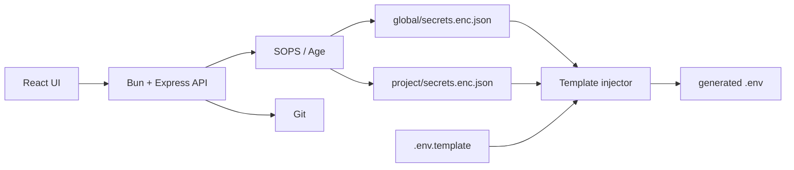

<p align="center">
  
</p>

<div align="center">

# Rage UI

Local-first secrets dashboard and GitOps `.env` injector.

[](https://github.com/Sofian-bll/Rage-UI/blob/main/LICENSE)
[](https://github.com/Sofian-bll/Rage-UI/tags)
[](https://github.com/Sofian-bll/Rage-UI/stargazers)

</div>

> [Read in English](README.md) | [Lire en Français](README.fr.md)

## What is this?

Rage UI is a local-first web dashboard for managing shared and per-project secrets. It stores secrets as SOPS/Age-encrypted JSON files, lets you edit them from a React UI, and injects them into project `.env` files from templates.

Built for personal infrastructure, homelabs, and small project fleets where the same tokens or API keys are reused across several apps but should stay encrypted in Git.



## Quick Start

```bash
git clone https://github.com/Sofian-bll/Rage-UI.git
cd Rage-UI

# Backend (Bun)
cd backend && bun install && bun run server.ts

# Frontend (Vite + React) — second terminal
cd frontend && npm install && npm run dev
```

Backend: `http://localhost:3000` · Frontend: `http://localhost:5173`

## How it works

1. Keep shared secrets in `global/`
2. Define `.env.template` with `{{GLOBAL.KEY}}` and `{{KEY}}` placeholders
3. Click **Inject .env** to merge global + local into a generated `.env`
4. Sync encrypted files through Git from the UI

```
PROJECTS_DIR/
├── global/secrets.enc.json
├── pokedex/.env.template + secrets.enc.json
└── api_meteo/.env.template
```

## Configuration

| Variable | Purpose | Default |
|----------|---------|---------|
| `PROJECTS_DIR` | Projects directory | `./projects` |
| `APP_API_KEY` | Optional API key for write routes | unset |
| `SOPS_AGE_KEY_FILE` | Age key path | SOPS default |

## Docker

```bash
docker-compose up -d --build
```

Mounts: SOPS Age key, SSH key, projects directory.

## API

| Method | Route | Auth |
|--------|-------|------|
| `GET` | `/api/projects` | public |
| `GET` | `/api/secrets/:project` | public |
| `POST` | `/api/secrets/:project` | API key |
| `POST` | `/api/inject/:project` | API key |
| `GET` | `/api/git/status` | public |
| `POST` | `/api/git/sync` | API key |

## Project Structure

```
Rage-UI/
├── docs/
│   ├── assets/
│   │   └── logo.png
│   └── index.html
├── backend/
│   ├── app.ts
│   ├── app.test.ts
│   └── server.ts
├── e2e/
│   └── playwright.config.ts
├── frontend/
│   ├── src/
│   └── vite.config.js
├── Dockerfile
├── docker-compose.yml
├── LICENSE
├── README.md
└── README.fr.md
```

## Documentation

| Resource | Description |
|----------|-------------|
| [`README.fr.md`](README.fr.md) | French version |
| [`docs/index.html`](docs/index.html) | Landing page |
| [`backend/README.md`](backend/README.md) | Backend notes |
| [`frontend/README.md`](frontend/README.md) | Frontend notes |

## Tests

```bash
cd backend && bun test          # Backend
cd frontend && npm run test      # Frontend
cd e2e && npm run test           # E2E (needs backend + frontend running)
```

## License

Rage UI is released under the [MIT License](LICENSE).

## Contributing

Issues and improvements welcome. Keep changes focused, update tests, and never commit real secrets or `.env` files.

<a href="https://github.com/Sofian-bll/Rage-UI/graphs/contributors">
  
</a>

---

<div align="center">

[](https://star-history.com/#Sofian-bll/Rage-UI&Date)

</div>
