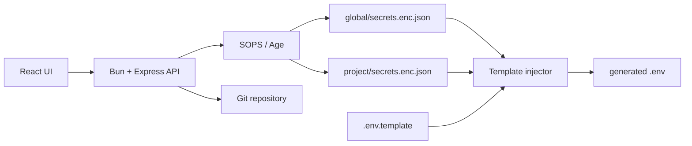

<p align="center">
  
</p>

<div align="center">

# Rage UI

Local-first secrets manager and GitOps `.env` injector for homelab and personal projects.

[](https://github.com/Sofian-bll/Rage-UI/blob/main/LICENSE)
[](https://github.com/Sofian-bll/Rage-UI/tags)
[](https://github.com/Sofian-bll/Rage-UI/stargazers)
[](frontend/package.json)
[](backend/package.json)
[](docker-compose.yml)

</div>

> [Read in English](README.md) | [Lire en Français](README.fr.md)

## What is this?

Rage UI is a local-first web app for managing shared and per-project secrets. It stores secrets as SOPS/Age-encrypted JSON files, lets you edit them from a React UI, and injects them into project `.env` files from templates.

It is built for personal infrastructure, homelabs, and small project fleets where the same tokens or API keys are reused across several apps but should stay encrypted in Git.

## How it works

1. Keep shared values in a central `global/` project.
2. Keep project-specific values beside each project.
3. Define `.env.template` files with placeholders such as `{{GLOBAL.DO_TOKEN}}` or `{{PORT}}`.
4. Click **Inject .env** to merge global and local secrets into a generated `.env` file.
5. Sync the encrypted secret files through Git, not the generated `.env` files.

```text
PROJECTS_DIR/
├── global/
│   └── secrets.enc.json
├── pokedex/
│   ├── .env.template
│   └── secrets.enc.json
└── api_meteo/
    ├── .env.template
    └── secrets.enc.json
```

## Architecture



## Quick Start

### Prerequisites

- Bun for the backend.
- Node.js and npm for the Vite frontend.
- SOPS and an Age key when you want to encrypt real secrets.

### 1. Clone the repository

```bash
git clone https://github.com/Sofian-bll/Rage-UI.git
cd Rage-UI
```

### 2. Run the backend

```bash
cd backend
bun install
bun run server.ts
```

The API runs on `http://localhost:3000`.

### 3. Run the frontend

Open a second terminal from the repository root:

```bash
cd frontend
npm install
npm run dev
```

The frontend runs on `http://localhost:5173` and proxies `/api` requests to the backend.

### 4. Try the injection flow

1. Select `global` and add a shared secret such as `POKE_API_KEY`.
2. Select a project such as `pokedex` and add a local value such as `PORT`.
3. Click **Inject .env**.
4. Check the generated `.env` file in the project folder.

## Template Syntax

| Syntax | Source | Example |
|--------|--------|---------|
| `{{GLOBAL.KEY}}` | Secret from `global/` | `{{GLOBAL.DO_TOKEN}}` |
| `{{KEY}}` | Secret from the active project | `{{PORT}}` |

Project secrets override global secrets when the same key is present in both places.

Example `.env.template`:

```dotenv
POKE_API_KEY={{GLOBAL.POKE_API_KEY}}
DO_TOKEN={{GLOBAL.DO_TOKEN}}
PORT={{PORT}}
HOST=pokedex.local
```

## Configuration

| Variable | Purpose | Default |
|----------|---------|---------|
| `PROJECTS_DIR` | Directory containing `global/` and project folders | `./projects` |
| `APP_API_KEY` | Optional API key for write routes via `x-api-key` | unset |
| `SOPS_AGE_KEY_FILE` | Age private key used by SOPS | SOPS default path |

To create an Age key:

```bash
brew install sops age
age-keygen -o ~/.config/sops/age/keys.txt
```

Add the printed public key to your `.sops.yaml` in the secrets repository.

## Docker

The repository includes a multi-stage Docker setup that serves the built frontend and backend from one container.

```bash
docker-compose up -d --build
```

The compose file mounts three host resources:

- the SOPS Age key file
- the SSH key used for Git sync
- the projects directory mounted as `PROJECTS_DIR`

## API Summary

| Method | Route | Description | Auth |
|--------|-------|-------------|------|
| `GET` | `/api/projects` | List project folders in `PROJECTS_DIR` | public |
| `GET` | `/api/secrets/:project` | Decrypt and return project secrets | public |
| `POST` | `/api/secrets/:project` | Encrypt and save project secrets | `APP_API_KEY` if set |
| `POST` | `/api/inject/:project` | Merge secrets into `.env.template` and write `.env` | `APP_API_KEY` if set |
| `GET` | `/api/git/status` | Return Git status for the project directory | public |
| `POST` | `/api/git/sync` | Run add, commit, and push for encrypted secret changes | `APP_API_KEY` if set |

## Project Structure

```text
Rage-UI/
├── assets/
│   └── logo.svg
├── backend/
│   ├── app.ts
│   ├── app.test.ts
│   ├── package.json
│   └── server.ts
├── docs/
│   ├── index.html
│   └── logo.svg
├── e2e/
│   ├── package.json
│   └── playwright.config.ts
├── frontend/
│   ├── package.json
│   ├── src/
│   └── vite.config.js
├── DAT-SOPS-GitOps-Architecture.pdf
├── Dockerfile
├── docker-compose.yml
├── LICENSE
└── README.md
```

## Documentation

| Resource | Description |
|----------|-------------|
| [`README.fr.md`](README.fr.md) | French version of this README. |
| [`backend/README.md`](backend/README.md) | Backend notes. |
| [`frontend/README.md`](frontend/README.md) | Frontend notes. |
| [`docs/index.html`](docs/index.html) | Portfolio landing page for GitHub Pages. |
| [`DAT-SOPS-GitOps-Architecture.pdf`](DAT-SOPS-GitOps-Architecture.pdf) | Architecture document. |

## Tests

```bash
# Backend
cd backend && bun test

# Frontend
cd frontend && npm run test

# End-to-end, with backend and frontend already running
cd e2e && npm run test
```

## Security Notes

- Commit encrypted `secrets.enc.json` files, not generated `.env` files.
- Never commit Age private keys, SSH keys, or local `.env` files.
- Use `APP_API_KEY` when exposing the app beyond trusted local development.
- Treat this as a local/homelab control plane, not as a public multi-tenant secret manager.

## Contributing

Issues and small improvements are welcome. Keep changes focused, add or update tests when behavior changes, and avoid committing real secrets or generated `.env` files.

<a href="https://github.com/Sofian-bll/Rage-UI/graphs/contributors">
  
</a>

## License

Rage UI is released under the [MIT License](LICENSE).

---

<div align="center">

[](https://star-history.com/#Sofian-bll/Rage-UI&Date)

</div>
